# Obligatorio DevOps 2024 Alumnos 305212-303898

El objetivo de este trabajo obligatorio es aplicar distintas disciplinas y conocimientos de DevOps con el fin de proporcionarle a la empresa retail detallada un servicio de calidad que resuelva las barreras entre los equipos de desarrolladores y operaciones. Adoptaremos tecnologías modernas y eficaces con el fin de desarrollar e implementar distintos tipos de estrategias que ayuden a impulsar y mantener correctas prácticas de planificación, coding, building, testeo, CI, CD, IaC y uso de servicio cloud.

Con el fin de realizar un uso apropiado de los conocimientos adquiridos a lo largo del curso de DevOps, decidimos trabajar con las siguientes tecnologías para realizar este trabajo obligatorio:

- Jira: Herramienta de planificación orientada a la visualización y organización de las distintas tareas a realizar en un proyecto (tablero Kanban). Con tareas para hacer, en proceso y ya hechas como la base de nuestro tablero. 
- Draw.io: Herramienta versátil que en este caso utilizamos para realizar los distintos diagramas de flujo requeridos para la entrega de este trabajo obligatorio. 
- GitHub: Permitiendo un manejo eficiente de nuestro código en forma de repositorios; a través de los cuales podremos hacer uso de su sistema de control de versionado. 
- GitHub Actions: Habilitando la posibilidad de establecer distintos tipos de pipelines directamente desde github hacia las distintas tecnologías que usaremos, con fácil acceso a todo nuestro código. Vital para nuestras estrategias de CI/CD. 
- Selenium: Entorno de pruebas de software utilizado para realizar distintos tipos de pruebas sobre nuestro FE y comprobar el correcto funcionamiento del mismo.
- SonarCloud: Herramienta de análisis de código estático; esencial para medir la calidad de nuestro código y tener la posibilidad de redactar informes en base a dichos análisis que nos proporcionen posibilidades de mejoría.
- AWS Lambda: Servicio sin servidor basado en el manejo de eventos en base a la ejecución de código. Lo utilizaremos para manejar eventos referidos a notificaciones sobre nuestros repositorios en ECR.
-  Amazon EvenBridge: Bus de eventos sin servidor que utilizaremos para complemente a Lambda y lograr establecer la clase de estructura que queremos implementar para nuestro sistema de notificaciones.
- Telegram: Plataforma de mensajería online que permite programar bots de forma rápida y sencilla con las herramientas del mismo sitio. Será importante a la hora de construir nuestro sistema de notificaciones, ya que es el medio por el cual llegarán las mismas. 
- AWS: Servicio en la nube de Amazon que nos brindará distintos tipos de opciones y facilidades.
- Docker: Fundamental para realizar y testear las imágenes de nuestros aplicativos, y luego igual de relevante a la hora de construir dichas imágenes para prepararlas a ser desplegadas hacia ECR.
- Terraform: Herramienta de IaC que nos permite definir y levantar fácil y eficazmente toda la infraestructura requerida que posteriormente necesitaremos para desplegar correctamente todos nuestros aplicativos BE.
- ECR: Servicio de almacenamiento administrado por la nube de amazon, esencial para almacenar las imágenes de los buildeos de nuestras aplicaciones BE.
- S3: Servicio de almacenamiento administrado por la nube de amazon, relevante a la hora de realizar el despliegue y host de nuestra aplicación front end y permitir además guardar una copia del state de nuestra infraestructura realizada con terraform.
- EKS: Servicio de clusters administrado por AWS que utiliza Kubernetes; funciona como la base sobre la que se sostiene todo nuestro BE una vez desplegado. Permite realizar con facilidad procesos de escalado, implementación y administración de aplicativos dentro de contenedores.

## Secrets y credenciales requeridas para un correcto uso de los repositorios:

El repositorio "[DevOps-Main](https://github.com/FI-ORT-DevOps-305212-303898/DevOps-Main)" debe tener los secrets "AWS_ACCESS_KEY_ID", "AWS_SECRET_ACCESS_KEY", "AWS_SESSION_TOKEN", "GH_TOKEN", "CLUSTER_NAME_DEV", "CLUSTER_NAME_TEST", "CLUSTER_NAME_MAIN"  y "SONAR_TOKEN" actualizados para un correcto funcionamiento. 

Las credenciales de AWS son para manejar el acceso a los servicios de Amazon y hacer uso de las tecnologías, mientras que el de GH permite que determinados workflows en el repositorio principal tengan acceso a los demás repositorios del BE y FE. Además, los secrets CLUSTER_NAME_DEV, CLUSTER_NAME_TEST y CLUSTER_NAME_MAIN son importantes para el manejo de nuestro workflow de deploy a EKS. Por último, el token de sonar permite realizar el análisis de código estático en SonarCloud.

## Manejo de repositorios:
Para este trabajo se define un esquema claro y organizado que permite la gestión eficiente de repositorios a través de un flujo de trabajo estructurado.

Para los repositorios de desarrollo, se utilizó una estrategia basada en GitFlow adaptada. Este enfoque define ramas estables (Main, Test, Bugfix, y Dev) y ramas efímeras creadas según la necesidad (por ejemplo, Feature 1, Feature 2 y Hotfix). Estas ramas efímeras tienen el compromiso de integrar sus cambios en las ramas superiores mediante estrategias claras de fusión o Cherry Pick.

A continuación, se adjunta el diagrama del flujo utilizado:
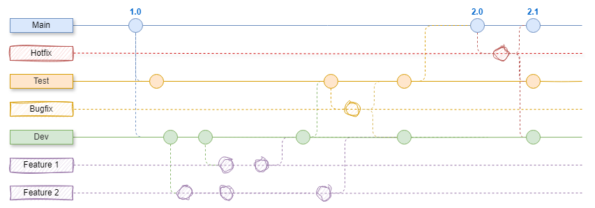

## Solución adoptada:

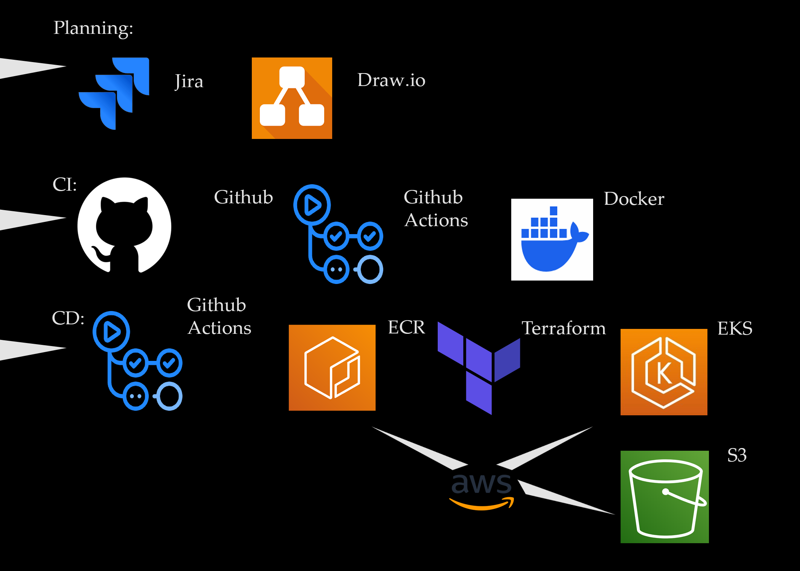

La solución adoptada se basa en pipelines CI/CD automatizados, diseñado para el despliegue eficiente de microservicios en una infraestructura moderna. A continuación, describimos cómo cada componente contribuye al flujo de trabajo:

#### Integración continua (CI):

El código fuente se aloja en GitHub, donde los desarrolladores colaboran y gestionan los cambios a través de ramas.
GitHub Actions automatiza la construcción, pruebas y validaciones para cada microservicio:
- Backend Microservicios: Cada microservicio (Orders, Payments, Products, Shipping) tiene un job dedicado que:
  - Clona el repositorio.
  - Construye una imagen Docker con las dependencias y configuraciones necesarias.
  - Sube las imágenes al Amazon Elastic Container Registry (ECR).
- Frontend: El repositorio del frontend se clona y se construye la aplicación React. El resultado se despliega como un sitio estático en Amazon S3.

#### Pruebas (Test):

- SonarCloud evalúa la calidad del código, verificando estándares, cobertura de pruebas y detectando vulnerabilidades.
- Selenium ejecuta pruebas  para garantizar que las funcionalidades críticas se comporten correctamente en los entornos de despliegue.

#### Entrega continua (CD):

Una vez validadas las imágenes Docker y construcciones de React, GitHub Actions realiza los despliegues:
- Backend: Los microservicios son desplegados en un clúster Amazon Elastic Kubernetes Service (EKS). Las configuraciones para cada microservicio se gestionan mediante manifiestos de Kubernetes (k8s/orders-service-deployment.yaml, etc.).
- Frontend: La aplicación React se sincroniza con un bucket S3. Este bucket está configurado para servir contenido estático con soporte de index.html como documento principal.

#### Serverless y orquestación:
- AWS Lambda: Se realiza tarea serverless de un bot, que avisa ante cambios en nuestros repositorios ECR.
- AWS EventBridge: Se crea regla que se encarga de enviarle un evento a Lambda como objeto JSON.

#### Gestión de infraestructura:
- Terraform gestiona toda la infraestructura como código (IaC), asegurando que los recursos de AWS (EKS, S3, ECR, etc.) estén configurados de forma consistente y reproducible.

## Evolución de Kanban en Jira a lo largo de la realización del obligatorio:

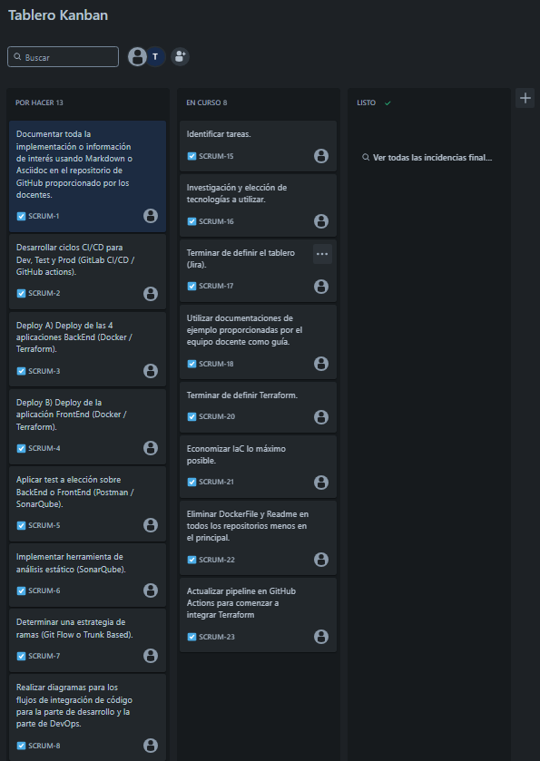

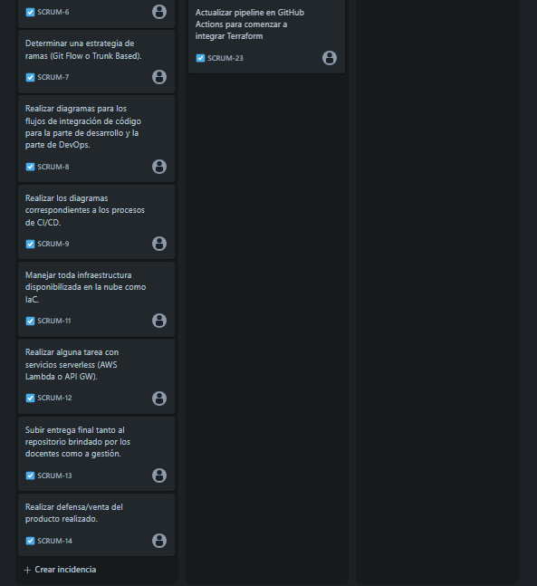

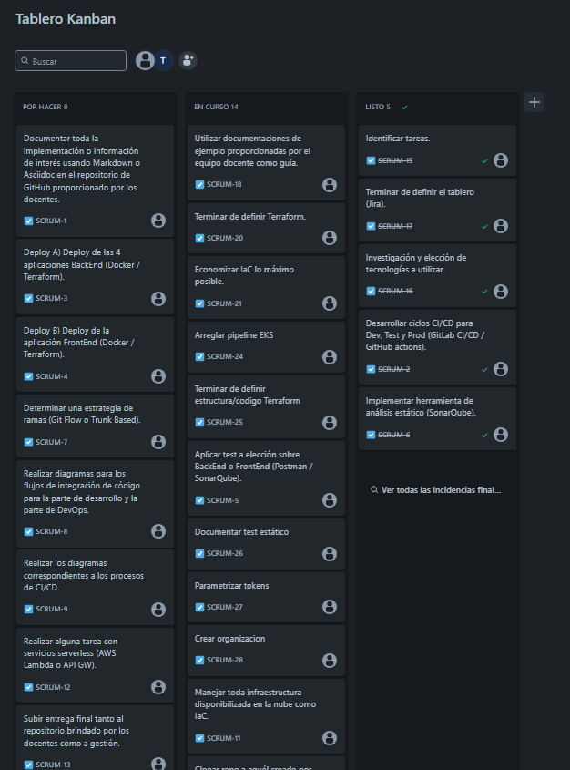

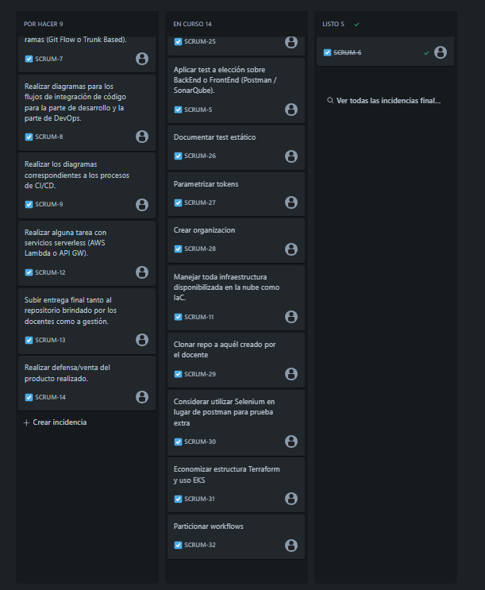

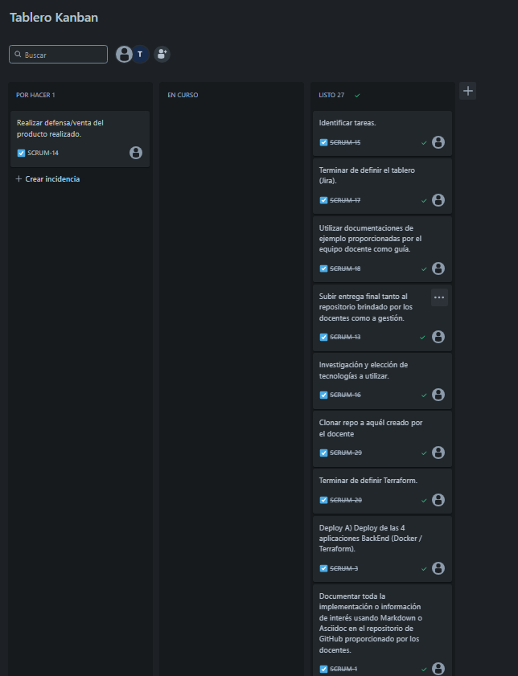

Nota: existen capturas extras que se encuentran en la carpeta imagenes de este mismo repositorio "DevOps-main" pero que decidimos no incluir aquí para no cubrir la documentación con un exceso de capturas que pueden no ser suficientemente relevantes.

## Test aplicado sobre aplicación FE elegida:

Decidimos hacer uso de Selenium para realizar una serie de pruebas en nuestro front end ([http://frontendbucket303898.s3-website-us-east-1.amazonaws.com/](http://frontendbucket303898.s3-website-us-east-1.amazonaws.com/ "http://frontendbucket303898.s3-website-us-east-1.amazonaws.com/")); además de Selenium como la base de nuestro entorno de pruebas, utilizamos un script de python con dependencias de webdriver y el navegador firefox con geckodriver.

También es importante notar que todos los archivos relevantes referidos a esta prueba se encuentran actualmente en el directorio "Selenium" de este mismo repositorio "DevOps-Main".

A continuación se adjuntan capturas con el código del script, el seteo de geckodriver en path, la lista de comandos utilizados y una captura del archivo de texto que se genera automáticamente al finalizar los test con información de los resultados obtenidos. También incluiremos una captura del front end desplegado para propósitos de ilustración.

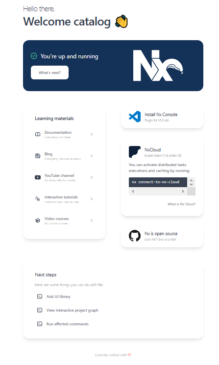

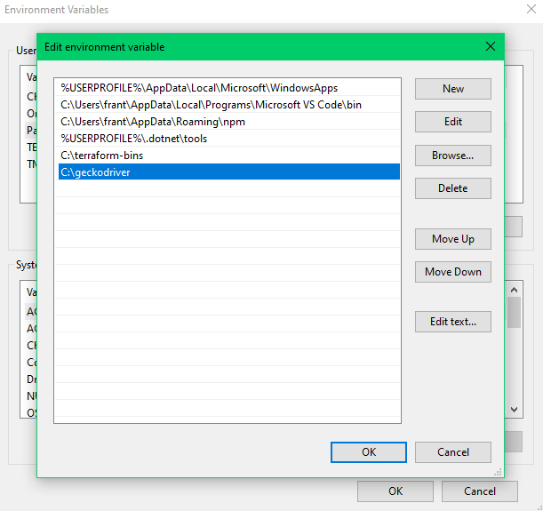

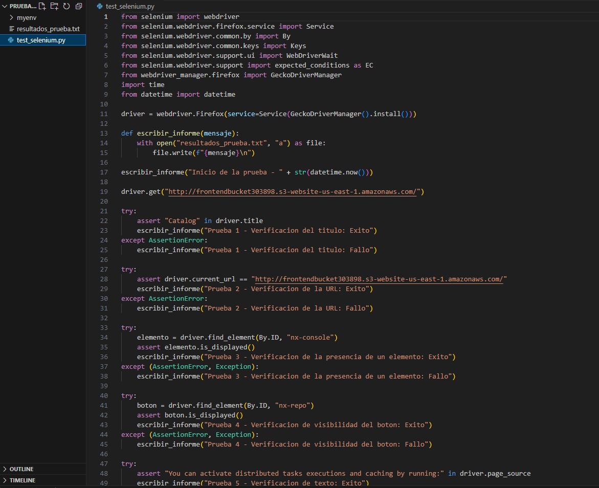

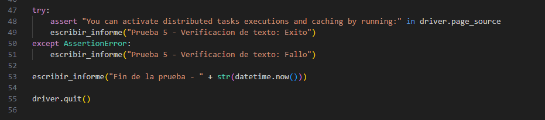

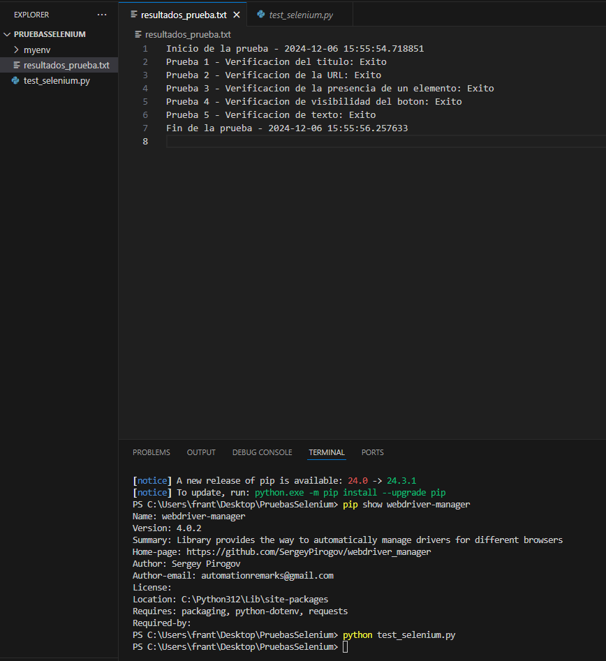

Los comandos e instrucciones esenciales para realizar estas pruebas son:

pip install selenium

Descargar y ubicar Geckodriver en path

pip install webdriver-manager

pip show webdriver-manager

python test_selenium.py

Las 5 pruebas realizadas devolvieron un mensaje de éxito; estas pruebas son relativamente sencillas pero nos permiten asegurarnos de que nuestro sitio web se desplegó de forma correcta en la forma en que esperábamos (con el título correcto, en la URL esperada, que tenga la presencia de determinados elementos que ejemplifican un despliegue como el esperado sin errores de visualización/en la interfaz) y que los tiempos de respuesta son los deseados/apropiados. En base a los test verificamos que no sólo las pruebas fueron un éxito en este caso, sino que además el tiempo de respuesta fue prácticamente inmediato; lo cual cumple con nuestras expectativas. 

## Análisis de los resultados de código estático en SonarCloud:

- Analizamos 6 proyectos (nuestros 4 repositorios de BE, nuestro único repositorio de FE y finalmente el repositorio principal de devops). 
- Se nos indica que hay una mayoría total de líneas de código en java y xml. 
- De los 6 proyectos, 4 tienen un 100% en seguridad y 2 tienen problemas menores.
- 4 de 4 proyectos analizados tienen un 100% de fiabilidad.
- Existe una duplicación de 5.6% de código en el repositorio "DevOps-Main", un 15.7% en "DevOps-OrdersService" y un 12.7% en "DevOps-ShippingService". Lo que podría afectar la mantenibilidad.
- Existen 4 proyectos con alta mantenibilidad y 2 con deuda técnica pendiente ("DevOps-Main" y "DevOps-ShippingService").

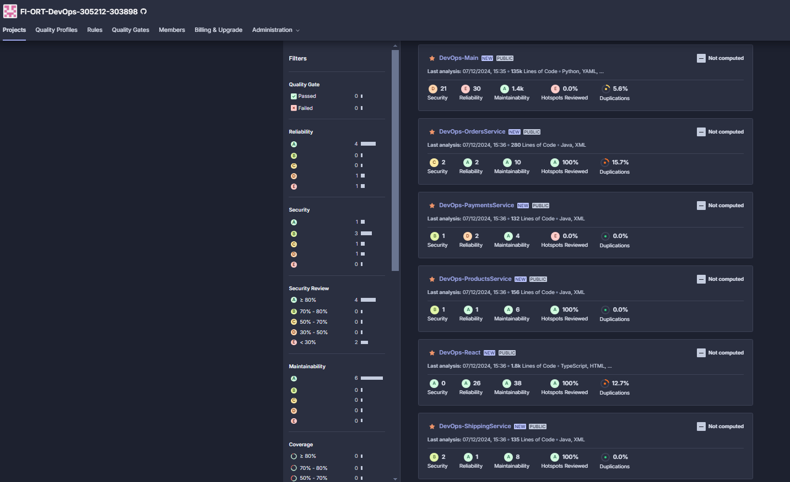

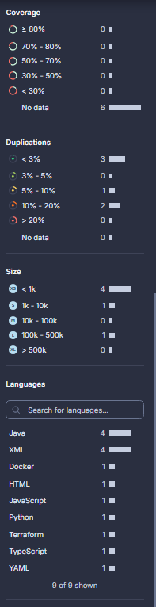

Sería ideal/recomendable:

- Reducir la duplicación en el código por medio de refactorización y reutilización de componentes.
- Implementar pruebas unitarias que garanticen la estabilidad del código.
- Continuar realizando tests periodicos con SonarCloud para garantizar estándares de seguridad y fiabilidad.
- Asegurarnos de mantener una baja deuda técnica mediante revisiones y mantenimiento de estándares de codificación.
- Documentar problemas y proponer planes de acción en plazos definidos.

## Implementación e instrucciones de Terraform:

Manejamos 4 archivos de terraform: terraform.tfvars, variables.tf, outputs.tf y main.tf. Main.tf es el que define la estructura y los recursos a crear, outputs define las salidas que se generan al aplicar la infraestructura, variables es utilizado para definir las variables que usamos en la configuración de los archivos y por último terraform.tfvars tiene los valores que van dentro de cada variable definida.

Todos nuestros archivos terraform se encuentran en la carpeta "Terraform" en el repositorio principal "DevOps-Main". Para poder correr los archivos y crear la infraestructura, lo que hacemos es descargar la carpeta anteriormente nombrada; para posteriormente abrirla con visual studio code, insertar todas nuestras credenciales de AWS con los valores de keys que se hayan generado al iniciar el lab en terminal powershell (aws configure set aws_access_key_id "ASIA...", aws configure set aws_secret_access_key "wJalrXU...", aws configure set aws_session_token "Fwo...", aws configure set region "us-east-1" y formato JSON si fuera necesario aclararlo), comprobar que estamos logeados correctamente desde la terminal con el comando aws sts get-caller-identity y luego procedemos a manejar directamente el código de terraform con: terraform init, terraform workspace new dev, terraform workspace new test, terraform workspace new main (generamos los ambientes que vayamos a levantar) y luego utilizamos terraform plan y terraform apply. Es importante notar que se nos pedirá que escribamos el nombre del ambiente para el que vamos a levantar la infraestructura; lo ideal es elegir una opción que sea "test", "main", o "dev" para que todo pueda ejecutarse de manera correcta.

Ejemplo de selección de nombre de cluster EKS para el ambiente que querramos trabajar:

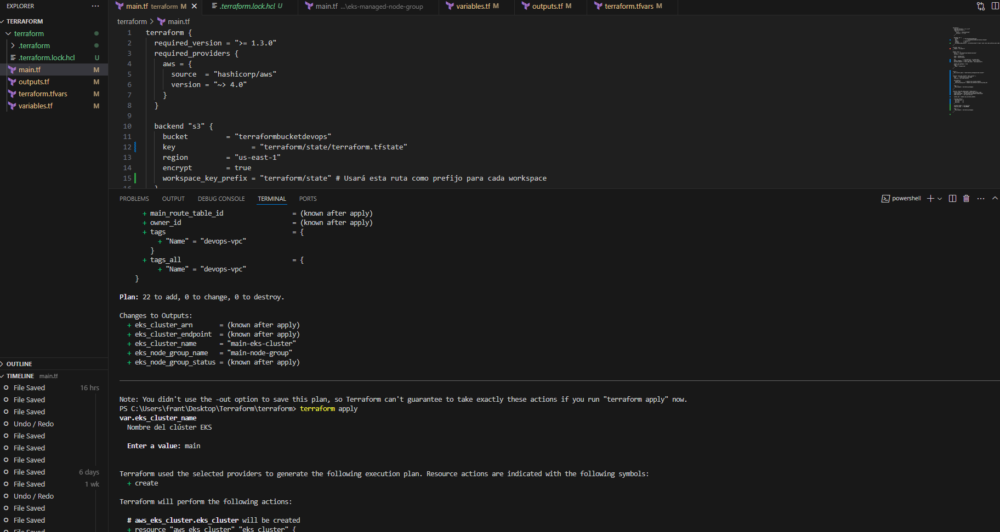

Ejemplo de confirmación requerida:

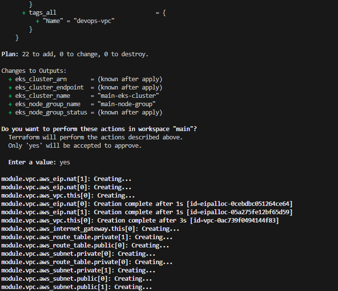

Ejemplo de un apply exitoso con los outputs esperados:

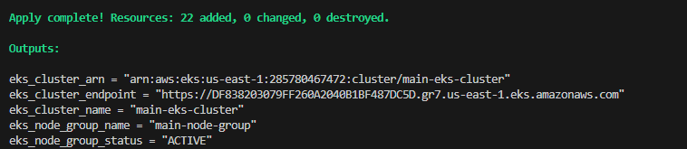

Una vez que la infraestructura de terraform está levantada, podemos proceder a ir a nuestro workflow "Deploy to EKS"; el cual se encargará de desplegar los pods y servicios en la infraestructura que creamos anteriormente. 

Instrucciones de comandos para terraform:

aws configure set aws_access_key_id "ASIA..."
aws configure set aws_secret_access_key "wJalrXU..."
aws configure set aws_session_token "Fwo..."
aws configure set region "us-east-1"
formato json (si es requerido)

aws sts get-caller-identity

terraform init

terraform workspace new dev
terraform workspace new test
terraform workspace new main

terraform workspace list

terraform workspace select ambiente (seleccionar uno específico y realizar los comandos de abajo para cada uno de los 3)

terraform plan 

terraform apply

Ubicación del state de terraform en s3 bucket

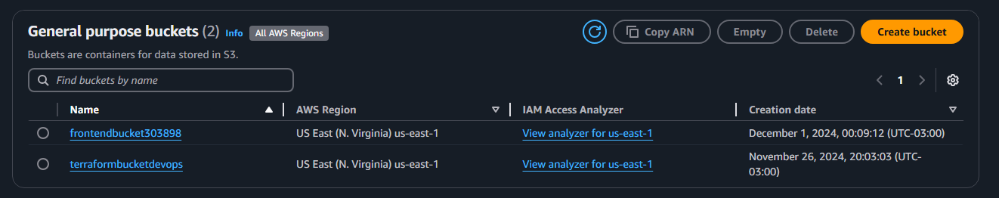

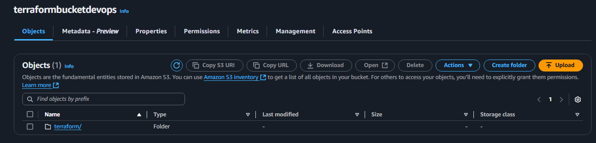

Una vez que querramos realizar el despliegue a EKS por github actions debemos escribir el nombre de cluster EKS para el ambiente que ibamos a trabajar (el mismo que el que elegimos cuando levantamos la infraestructura en terraform):

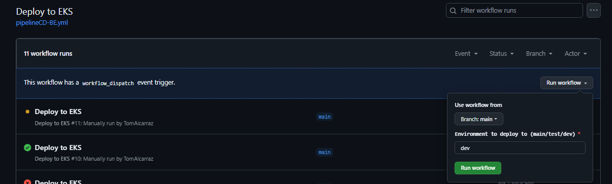

## Tarea realizada con servicios serverless:

Decidimos hacer uso de AWS Lambda para crear una función que nos avise a través de un bot de telegram cuando se realizan cambios en nuestros repositorios ECR. En esencia, Lambda se encarga de recibir el evento que se dispara cuando se detecta un cambio, y esto es posible gracias a una regla que creamos con Amazon EventBridge que se encarga de enviarle dicho evento a Lambda como un objeto JSON. Lambda toma esta información y la prepara para enviarla a nuestro bot en telegram. Lo cual es posible ya que están establecidas las correctas credenciales requeridas para que Lambda se comunique directamente con dicho bot y le envíe la información.
Crear bots en telegram es una práctica relativamente fácil; se debe buscar un bot llamado "BotFather" con el que podemos elegir el nombre del bot y nos dan un token que será útil para todo lo que configuremos posteriormente. Luego, prácticamente todo el código que utiliza el bot es proporcionado por la función Lambda en sí y procesado por la API de telegram. Por lo que dicho bot sólo actúa como emisor de un mensaje cuya lógica ya tiene resuelta. 
Dicha lógica está resuelta con Node.js y Axios; el propósito de Axios es el de permitir enviar la solicitud POST a la api de telegram que se requiere para notificar de los cambios realizados. 

A continuación se adjuntarán capturas relevantes:

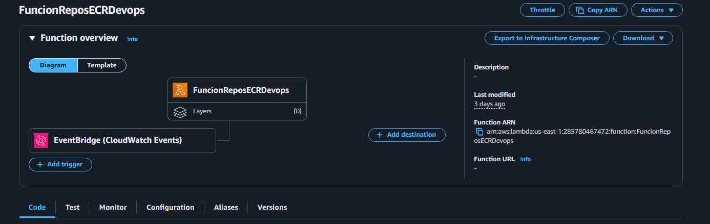

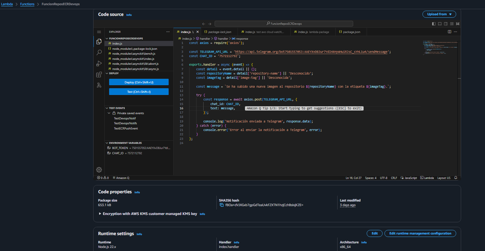

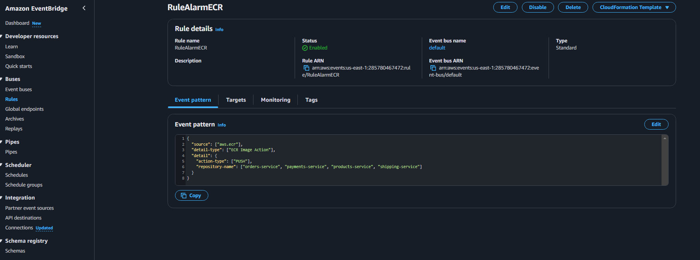

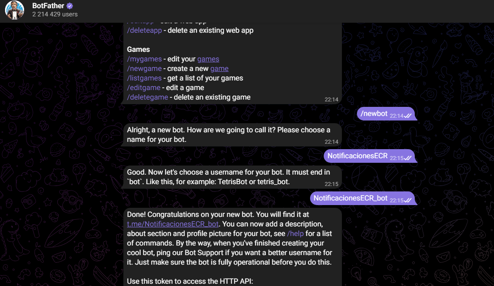

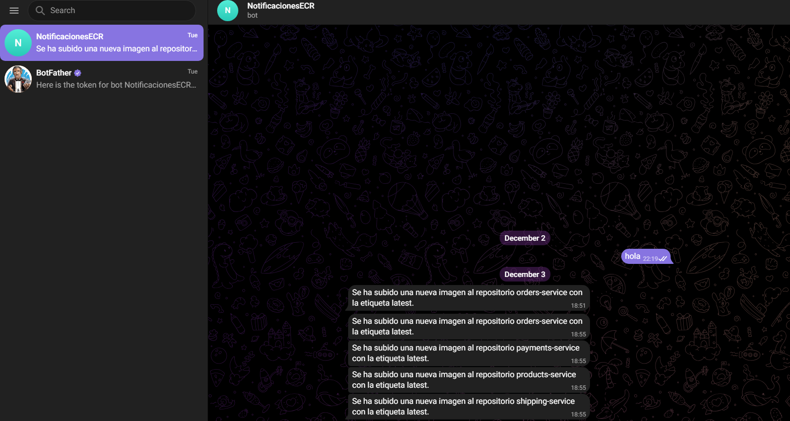

## Inteligencia artificial generativa: 

Hicimos uso de dicha tecnología con el fin de generar ejemplos que nos ayudaran a comprender como aproximarnos a la realidad planteada por el obligatorio; todo código generado fue utilizado de maneras transformativas y funcionó a modo de apoyo en casos concretos. Por ejemplo, en la corrección de archivos como outputs.tf o terraform.tfvars de terraform para asegurarnos que estabamos realizando una correcta configuración de los mismos. 
