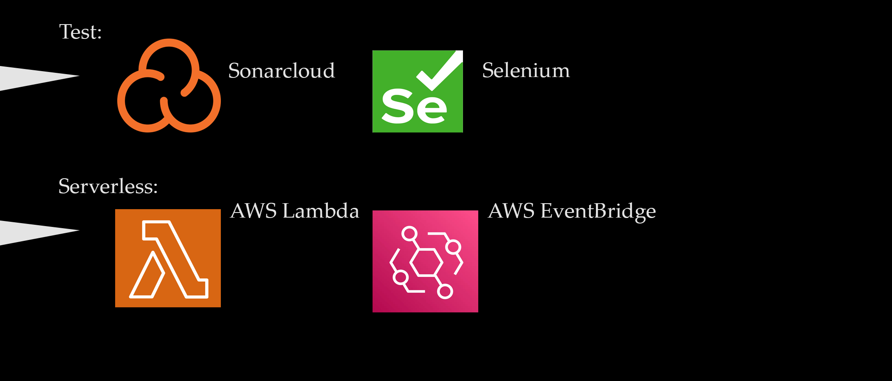

# Obligatorio DevOps 2024

El objetivo de este trabajo obligatorio es aplicar distintas disciplinas y conocimientos de DevOps con el fin de proporcionarle a la empresa retail detallada un servicio de calidad que resuelva las barreras entre los equipos de desarrolladores y operaciones. Adoptaremos tecnologías modernas y eficaces con el fin de desarrollar e implementar distintos tipos de estrategias que ayuden a impulsar y mantener correctas prácticas de planificación, coding, building, testeo, CI, CD, IaC y uso de servicio cloud.

Con el fin de realizar un uso apropiado de los conocimientos adquiridos a lo largo del curso de DevOps, decidimos trabajar con las siguientes tecnologías para realizar este trabajo obligatorio:

- Jira: Herramienta de planificación orientada a la visualización y organización de las distintas tareas a realizar en un proyecto (tablero Kanban). Con tareas para hacer, en proceso y ya hechas como la base de nuestro tablero. 
- Draw.io: Herramienta versátil que en este caso utilizamos para realizar los distintos diagramas de flujo requeridos para la entrega de este trabajo obligatorio. 
- GitHub: Permitiendo un manejo eficiente de nuestro código en forma de repositorios; a través de los cuales podremos hacer uso de su sistema de control de versionado. 
- GitHub Actions: Habilitando la posibilidad de establecer distintos tipos de pipelines directamente desde github hacia las distintas tecnologías que usaremos, con fácil acceso a todo nuestro código. Vital para nuestras estrategias de CI/CD. 
- Selenium: Entorno de pruebas de software utilizado para realizar distintos tipos de pruebas sobre nuestro FE y comprobar el correcto funcionamiento del mismo.
- SonarCloud: Herramienta de análisis de código estático; esencial para medir la calidad de nuestro código y tener la posibilidad de redactar informes en base a dichos análisis que nos proporcionen posibilidades de mejoría.
- AWS Lambda: Servicio sin servidor basado en el manejo de eventos en base a la ejecución de código. Lo utilizaremos para manejar eventos referidos a notificaciones sobre nuestros repositorios en ECR.
-  Amazon EvenBridge: Bus de eventos sin servidor que utilizaremos para complemente a Lambda y lograr establecer la clase de estructura que queremos implementar para nuestro sistema de notificaciones.
- Telegram: Plataforma de mensajería online que permite programar bots de forma rápida y sencilla con las herramientas del mismo sitio. Será importante a la hora de construir nuestro sistema de notificaciones, ya que es el medio por el cual llegarán las mismas. 
- AWS: Servicio en la nube de Amazon que nos brindará distintos tipos de opciones y facilidades.
- Docker: Fundamental para realizar y testear las imágenes de nuestros aplicativos, y luego igual de relevante a la hora de construir dichas imágenes para prepararlas a ser desplegadas hacia ECR.
- Terraform: Herramienta de IaC que nos permite definir y levantar fácil y eficazmente toda la infraestructura requerida que posteriormente necesitaremos para desplegar correctamente todos nuestros aplicativos BE.
- ECR: Servicio de almacenamiento administrado por la nube de amazon, esencial para almacenar las imágenes de los buildeos de nuestras aplicaciones BE.
- S3: Servicio de almacenamiento administrado por la nube de amazon, relevante a la hora de realizar el despliegue y host de nuestra aplicación front end y permitir además guardar una copia del state de nuestra infraestructura realizada con terraform.
- EKS: Servicio de clusters administrado por AWS que utiliza Kubernetes; funciona como la base sobre la que se sostiene todo nuestro BE una vez desplegado. Permite realizar con facilidad procesos de escalado, implementación y administración de aplicativos dentro de contenedores.

## Secrets y credenciales requeridas para un correcto uso de los repositorios:

El repositorio "[DevOps-Main](https://github.com/FI-ORT-DevOps-305212-303898/DevOps-Main)" debe tener los secrets "AWS_ACCESS_KEY_ID", "AWS_SECRET_ACCESS_KEY", "AWS_SESSION_TOKEN", "GH_TOKEN" y "SONAR_TOKEN" actualizados para un correcto funcionamiento. 

Las credenciales de AWS son para manejar el acceso a los servicios de Amazon y hacer uso de las tecnologías, mientras que el de GH permite que determinados workflows en el repositorio principal tengan acceso a los demás repositorios del BE y FE. Por último, el token de sonar permite realizar el análisis de código estático en SonarCloud.

## Test aplicado sobre aplicación FE elegida:

Decidimos hacer uso de Selenium para realizar una serie de pruebas en nuestro front end ([http://frontendbucket303898.s3-website-us-east-1.amazonaws.com/](http://frontendbucket303898.s3-website-us-east-1.amazonaws.com/ "http://frontendbucket303898.s3-website-us-east-1.amazonaws.com/")); además de Selenium como la base de nuestro entorno de pruebas, utilizamos un script de python con dependencias de webdriver y el navegador firefox con geckodriver.

A continuación se adjuntan capturas con el código del script, la lista de comandos utilizados y una captura del archivo de texto que se genera automáticamente al finalizar los test con información de los resultados obtenidos. También incluiremos una captura del front end desplegado para propósitos de ilustración.

Las 5 pruebas realizadas devolvieron un mensaje de éxito; estas pruebas son relativamente sencillas pero nos permiten asegurarnos de que nuestro sitio web se desplegó de forma correcta en la forma en que esperábamos (con el título correcto, en la URL esperada, que tenga la presencia de determinados elementos que ejemplifican un despliegue como el esperado sin errores de visualización/en la interfaz) y que los tiempos de respuesta son los deseados/apropiados. En base a los test verificamos que no sólo las pruebas fueron un éxito en este caso, sino que además el tiempo de respuesta fue prácticamente inmediato; lo cual cumple con nuestras expectativas. 

## Tarea realizada con servicios serverless:

Decidimos hacer uso de AWS Lambda para crear una función que nos avise a través de un bot de telegram cuando se realizan cambios en nuestros repositorios ECR. En esencia, Lambda se encarga de recibir el evento que se dispara cuando se detecta un cambio, y esto es posible gracias a una regla que creamos con Amazon EventBridge que se encarga de enviarle dicho evento a Lambda como un objeto JSON. Lambda toma esta información y la prepara para enviarla a nuestro bot en telegram. Lo cual es posible ya que están establecidas las correctas credenciales requeridas para que Lambda se comunique directamente con dicho bot y le envíe la información.
Crear bots en telegram es una práctica relativamente fácil; se debe buscar un bot llamado "BotFather" con el que podemos elegir el nombre del bot y nos dan un token que será útil para todo lo que configuremos posteriormente. Luego, prácticamente todo el código que utiliza el bot es proporcionado por la función Lambda en sí y procesado por la API de telegram. Por lo que dicho bot sólo actúa como emisor de un mensaje cuya lógica ya tiene resuelta. 
Dicha lógica está resuelta con Node.js y Axios; el propósito de Axios es el de permitir enviar la solicitud POST a la api de telegram que se requiere para notificar de los cambios realizados. 

A continuación se adjuntarán capturas relevantes:

